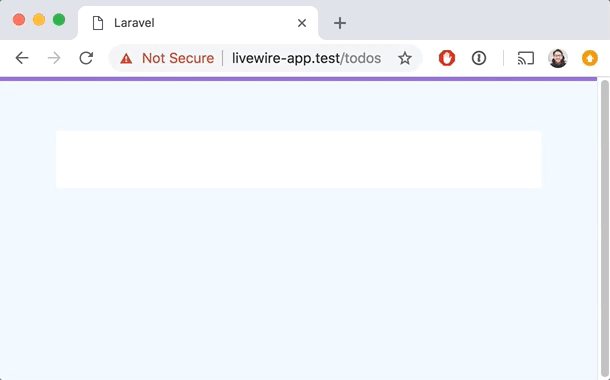

# Livewire Docs

Livewire is a view-layer framework for Laravel that will blow your freaking mind.

[Blow my mind](#blow-my-mind)
[Installation](#installation)

# Blow my mind
Let me take you on a quick journey through time to show you the need Livewire meets. If your mind is not blown by the end of this, I'll give you your money back.

Consider the age old "TODO" functionality an app might need.



### All-backend
At the dawn of time, our ancestors were building app in the traditional MVC style. The way they would have achieved dynamic functionality, was through form submissions and full-page reloads. They would have utilized a Route, a Controller, and a View everytime they needed to update a webpage. Let's look at some sample code that we believe looks something like what they would have wrote:

*route*
```php
Route::get('/todos', 'TodoController@index');
Route::post('/todos', 'TodoController@store');
```

*controller*
```php
TodoController extends Controller
{
    public function index()
    {
        return view('todos', ['todos' => Todo::all()]);
    }

    public function store()
    {
        Todo::create([
            'title' => request('title'),
        ]);

        return back();
    }
}
```

*view*
```html
<form action="/todos" method="POST">
    <input name="title">
</form>

<ul>
    @foreach ($todos as $todo)
        <li>{{ $todo->title }}</li>
    @endforeach
</ul>
```

## All-frontend
Fast-forward to 2019. Javascript is taking over the world. Gone are the dark days of full-page reloads, everything is done in a browser, in real-time, without reloading the page. Front-end frameworks like React, Angular, and Vue make listening for user events, tracking state, and making server requests in the background via Ajax a cinch. Here is how TODO apps are being written now-adays: (we'll use Vue for this example)

*Vue routes*
```javscript
const routes = [
  { path: '/todos', component: TodoIndex },
]
```

*Vue component*
```vue
<template>
<div>
    <form @submit="addTodo">
        <input name="title" v-model="title">
    </form>

    <ul>
        <li v-for="(todo, index) in todos" :key="todo.id">{{ todo.title }}</li>
    </ul>
</div>
</template>

<script>
export default {
    data() {
        return {
            title: '',
            todos: [],
        }
    },

    created() {
        this.fetchTodos()
    },

    methods: {
        fetchTodos() {
            axios.get('/todos', response => {
                this.todos = response.data.todos
            })
        },

        addTodo() {
            axios.post('/todos', { title: this.title })
                .then(() => {
                    this.title = ''
                    this.fetchTodos()
                })
        }
    }
}
</script>
```

*Laravel routes*
```php
Route::get('/todos', 'TodoController@index');
Route::post('/todos', 'TodoController@store');
```

*Laravel controller*
```php
TodoController extends Controller
{
    public function index()
    {
        return ['todos' => Todo::all()];
    }

    public function store()
    {
        return Todo::create([
            'title' => request('title'),
        ]);
    }
}
```

## Frontent <3 Backend
The all-backend approach was so simple, so clean, so easily testable. However, every user interaction required a full-page reload, and this just wasn't enough. We went all crazy with SPAs and completely separated the front-end from the backend. We thought this was better for some reason. Our front-ends were buttery smooth, but we were writing twice as much code as before and managing two codebases, not to mention testing both parts seperately and together was rediculously hard. The complexity was just overwhelming. Now, in the future, the line between front-end and backend will become fuzzy as we come up with frameworks that take care of the tedius front-end wiring we were doing before. Introducing: Livewire.

*routes file*
```php
Route::livewire('/todos', Todos::class);
```

*Livewire component*
```
class Todos extends LivewireComponent
{
    public $title;

    public function addTodo()
    {
        Todo::create(['title' => $this->title]);

        $this->title = '';
    }

    public function render()
    {
        return view('todos, ['todos' => Todo::all()]);
    }
}
```

*Livewire view*
```html
<div>
    <form wire:submit="addTodo">
        <input name="title" wire:model="title">
    </form>

    <ul>
        @foreach ($todos as $todo)
            <li>{{ $todo->title }}</li>
        @endforeach
    </ul>
</div>
```

## Mind blown?
If you followed along, you'll see, Livewire is an interesting blend of paradaigms and syntax you're used to in both the frontend and the backend in the same tool. If you're happy with what you see and want to get started, read on. If you want to know how this wizardry is possible, check out "how does livewire work?". If you it didn't click and you're confused, maybe try building a sample app and toying with it to see if the use cases become clear.

# Installation
Livewire has both a PHP component AND a Javascript component. You need to make sure both are available in your project before you can use it.

## Install via composer
`composer require calebporzio/livewire`

## Include Javascript via snippet
To get started quickly, you can include the following snippet at the end of the `<body>` in your html page:

```html
        ...
        <script>{!! Livewire::scripts() !!}</script>
        <script>Livewire.start()</script>
    </body>
</html>
```

## Include Javascript via NPM
If you have a more sophistocated javascript build setup, you can install and import Livewire via NPM.

`npm install laravel-livewire --save`

```js
import Livewire from 'laravel-livewire'

Livewire.start()
```

## Rendering your first Livewire component

Run `artisan livewire:make Counter` to generate a new Livewire Component here: `app/Http/Livewire/Counter.php`.

Note: you can optionally add the `—view` flag to generate a corresponding view in: `resources/views/livewire/counter.blade.php`

You should now have a component that looks like this:
```
class Counter extends LivewireComponent
{
    public function render()
    {
        return view('livewire.counter');
    }
}
```

And a view that looks like:
```
<div>
    {{-- Go effing nuts. --}}
</div>
```

You can render it in a view using the following directive:
```
@extends('layouts.app')

@section('content')
<div>
    @livewire(App\Http\Livewire\Counter::class)
</div>
@endsection
```

## Let’s manage some state
In Livewire, state is stored in your component as class properties.

Let’s create a state to store the current count of our counter component:
```
class Counter extends LivewireComponent
{
    public $count = 0;

    public function render()
    {
        return view('livewire.counter');
    }
}
```

Component properties are made available in the blade view automatically. We can display that state in our view just like we would in a traditional blade view:
```
<div>
    {{ $count }}
</div>
```

## Mutating state
Let’s add `+` and `-` buttons to our view, that we will wire up to our component.
```
<div>
    {{ $count }}
    <button>+</button>
    <button>-</button>
</div>
```

Now let’s add “increment” and “decrement” behavior to our component:
```
class Counter extends LivewireComponent
{
    public $count = 0;

    public function increment()
    {
        $this->count++;
    }

    public function decrement()
    {
        $this->count--;
    }

    public function render()
    {
        return view('livewire.counter');
    }
}
```

Now, let’s wire that new behavior up in our view:
```
<div>
    {{ $count }}
    <button wire:click="increment">+</button>
    <button wire:click="decrement">-</button>
</div>
```

Viola! Livewire will handle all the behind the scenes magic. All you have to know is that when a user clicks on one of those buttons, the appropriate methods will be called on your component, and the entire thing will be re-rendered without a page load. Pretty cool huh?


# Binding Data
You can bind the value of `<input>` elements to your component properties just like you would in VueJs with something like `v-model`. In livewire, the syntax is `wire:model`. Here is an example todo list component.

Livewire component
```
class Todos extends LivewireComponent
{
    public $todo = '';
    public $todos = [];

    public function addTodo()
    {
        $this->todos[] = $this->todo;
        $this->todo = '';
    }

    public function render()
    {
        return view('livewire.todos');
    }
)
```

Component view (`livewire/todos.blade.php`)
```
<div>
    <input type="text" wire:model="todo">
    <button wire:click="addTodo">Add Todo</button>

    <ul>
    @foreach ($todos as $todo)
       <li>{{ $todo }}</li>
    @endforeach
    </ul>
</div>
```


## TODO
* 2 options: the directive OR the route macro (routing) (route-model binding)
* binding data `wire:model`
* listening for events`wire:click`, `wire:submit`, `wire:keydown`
	* adding `prevent`, `stop`, `min.250ms`
* loading, transitions
* validating
* redirecting
* nesting! (emiting, passing data in)
* testing
* Turbolinks
* setting a custom prefix
* drivers
